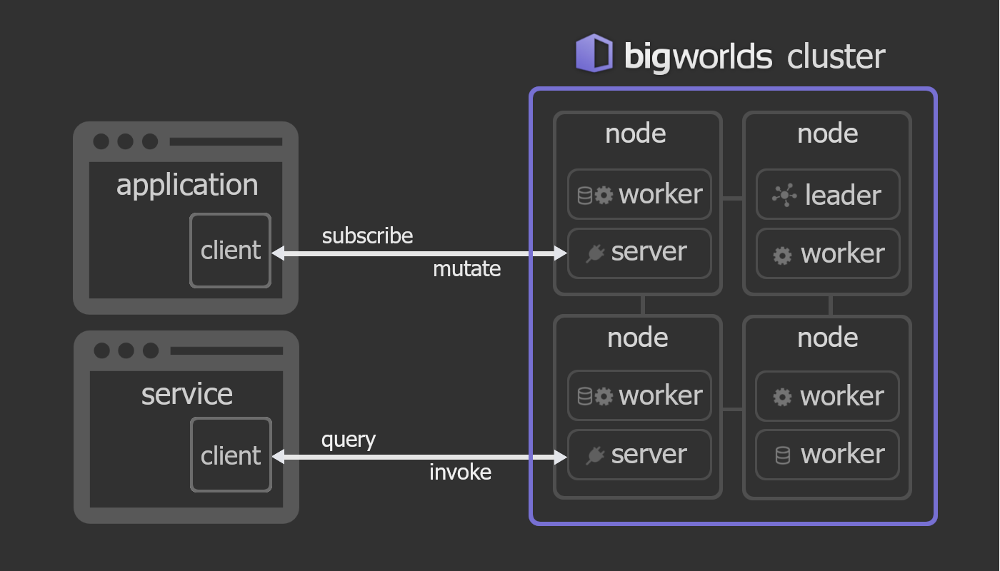

## 

Dynamically scalable virtual worlds.

[]()
[]()
[](https://discord.gg/SHQ3rYvn3B)

A novel general-purpose framework for assembling and running large agent-based
simulations.

With potential applications ranging from games to business intelligence, it is
an attempt to solve the problem of efficient horizontal scaling for systems
made up of large numbers of discrete simulated elements. The goal is to enable
effortless deployment of huge virtual worlds with billions of interacting
entities and tens of thousands of simultanously connected clients.


> [!NOTE]  
> `bigworlds` is currently under heavy development. Here's the simplified
> roadmap towards the alpha `0.2.0` release:
> - [x] logic: rudimentary support for multiple behavior types (dynlib, lua,
> wasm, dsl)
> - [x] connectivity: unified approach to local vs remote cluster participants
> - [x] querying: one-shot RPC and streaming subscriptions
> - [ ] persistence and reliability: entity fs storage, in-RAM redundance policies,
> snapshots
> - [ ] visibility: `websocket` client, browser-based (wasm) inspector
> - [ ] polyglot demo: Unity C# viewer for one of the existing demos 




### What is `bigworlds`?

Heavily inspired by both the ECS pattern and the actor model, `bigworlds`
provides a refreshing take on large-scale, dynamic simulation.

Discrete *entities* are composed out of *components*, encapsulating object
characteristics in a flexible yet well-defined way. Data is stored on the
entity level, allowing for fast migration across the cluster at runtime.

Logic is provided either through runtime-managed *behaviors* or through
*services*—arbitrary client programs mutating simulation state from outside.
Logic can be driven with either global events or regular time cycles, with the
system providing a bespoke synchronization mechanism out-of-the-box.

`bigworlds` clusters are built up from individual `workers`, each capable of
asynchronously performing system-wide queries and serving the data out to
subscribers. This allows supporting very large numbers of concurrently
connected clients.

The runtime is kept as generic as possible, allowing for wide variety of logic
and compute configurations. This includes dynamic cluster enlargement and
changes to the simulation model at runtime.

Actors with complex sets of behaviors can be constructed and deployed into the
simulated world at any point, including by other actors at runtime. Interesting
multi-layer patterns are possible, with actors being able to start up nested
`bigworlds` simulations themselves.

For a more concrete system design overview see `DESIGN.md`.


### Quick-start

`bigworlds-cli` command-line tool allows to easily create and interact with
bigworlds simulations.

You should be able to run it by just doing `cargo run` after cloning the
repository.

Consider running provided example models, like so:

```
cd examples/cubes
cargo run --release -- run -i
```

The `run` subcommand will start up a single-worker cluster locally and load up
the model we provide it with.

The `-i` flag stands for `--interactive`. It gives us an interactive prompt
interface right in the command line that we can use to inspect and mutate the
simulated world.

Try stepping through the simulation by just pressing `ENTER` a few times. You
can also try listing all the entities' data with `ls`. Type in `help` for
a list of things you can do while in the interactive mode.


#### Assembling a cluster

Networked cluster can be assembled from multiple worker processes.

`bigworlds-cli` provides a set of commands for starting up relevant cluster
participants, with optional elements such as `servers`.

Consider starting up a simple two-worker cluster:

```
# worker 0
cargo run --release -- worker --leader 127.0.0.1:9901

# worker 1
cargo run --release -- worker --remote-leader 127.0.0.1:9901
```

With the first invocation we're spawning both a worker and a leader on the same
process. Note how we also exposed a listener for the leader. We use that to
connect the second worker.

We now have a tiny cluster set up. But we won't be able to attach to it with
a client as there's no server exposed. Let's fix that by adding a third worker.

```
# worker 2
cargo run --release -- worker --remote-leader 127.0.0.1:9901 --server 127.0.0.1:9123
```

With the `--server` option we specify that we also want to establish a server
task backed by the worker we're starting.

Now we should be able to attach to our cluster with an interactive client:

```
cargo run --release -- client -s 127.0.0.1:9123 -i
```

We now have access to the cluster through the interactive prompt. With that we
should be able to push a model to the cluster and initialize it. See the
`bigworlds-cli` documentation for guides on how to do all that and more.


#### Code examples

A great way to jump into the code-base is to go through the examples at
`lib/examples`. They are generally kept up-to-date and pretty well-commented.

You can run the examples while in the top-level directory:

```
# List all the available examples
# cargo run --example

# Run the shuffle example
cargo run --example shuffle
```


### Project goals

Although still very much in its infancy at this point, `bigworlds`
attempts to broaden the horizon of what's possible with large multiplayer,
complex simulation systems. Inspired by projects like `SpatialOS`,
`SpacetimeDB`, `Metagravity`, `HadeanOS` and `Star Citizen`, it tries to
deliver a solution that has not yet been attempted.

Distinct from the above projects, `bigworlds` is not exclusively focused on
supporting conventional, fast-paced multiplayer games. That said it should
still support building relatively-high-fidelity multiplayer applications.

We believe there are many extremely interesting applications that are not
catered to yet with similar systems. We want to make assembling and running
large-scale socio-economic, ecological, etc. simulations feasible on
off-the-shelf hardware, cutting operational costs drastically.

With the recent advancements in AI/LLM systems, we believe our approach could
prove great for training AI agents on close-to-real-world scenarios, without
taking out all the inherent complexity of real-world systems from the training
as is usually the case these days.

As making model definition process scalable is crucial for sustaining large
projects, we want to maintain as much flexibility as possible, supporting
multiple ways for providing data and composing logic.


### Limitations

With the whole system being designed around distributed storage, retrieval
times are the biggest limitation of the system. While it's also built with
dynamic migration based on access patterns in mind, given how physics works,
this will always be slower than localized systems optimized in line with
hardware specification.

Data storage is implemented in a way that optimizes for entity-level retrieval
and transfer between nodes. This leads to a trade-off when considering entity
size in terms of amount of data per entity. 

`bigworlds` is unlikely to ever provide strong guarantees in terms of atomicity
of transactions. It shouldn't be kept up to database standards.


